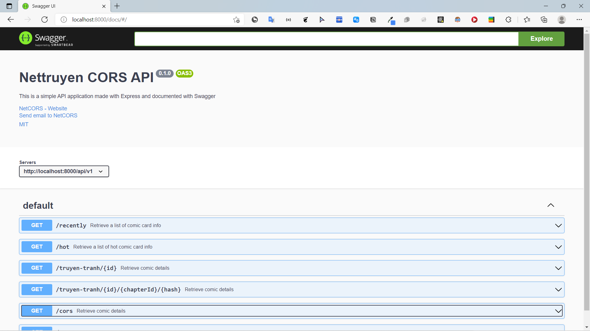
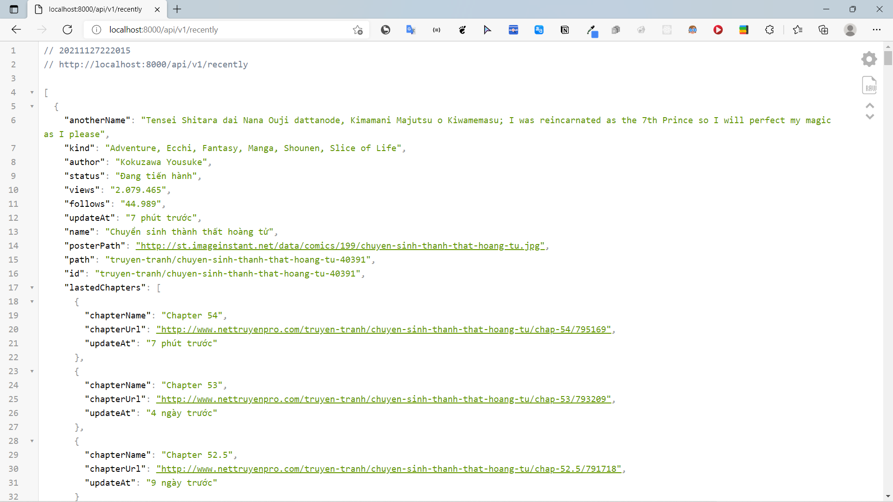

# Nettruyen CORS Api
### Status


### Screenshot




### Install

#### Setup
  - Rename .env.example to .env and change DB_PASSWORD

```bash
git clone https://github.com/hahunavth/comic-net-server/
cd comic-net-server/
yarn
yarn start
```
